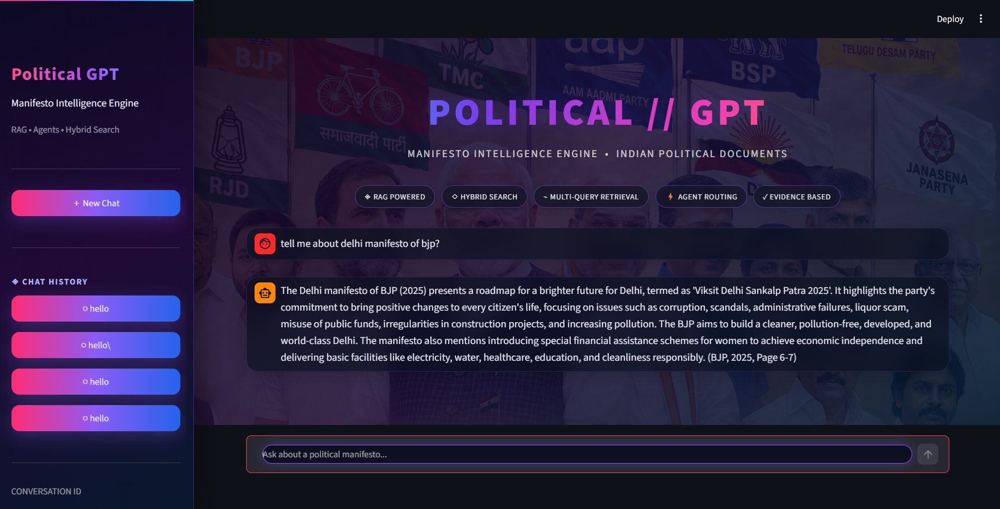
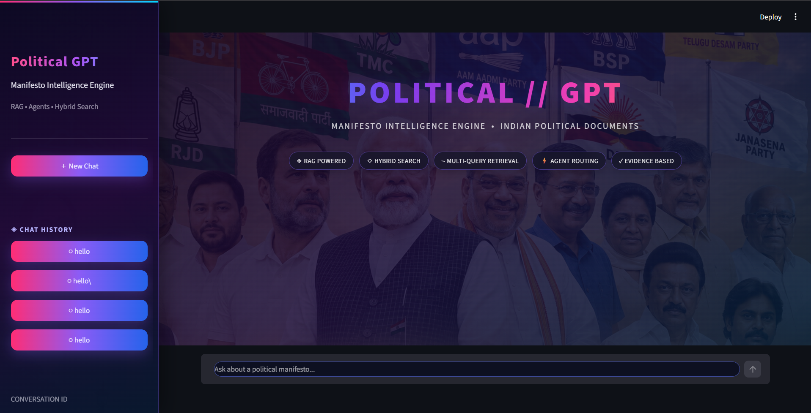

# 🇮🇳 Political Multi-Agent Hybrid RAG

### An Agentic RAG System for Exploring and Comparing Indian Political Manifestos

A multi-agent AI chatbot that allows users to ask questions about Indian political party manifestos, retrieve relevant evidence, and compare policies across parties and election years.

The project combines **Multi-Agent AI, Hybrid RAG, Multi-Query Retrieval, BM25, ChromaDB, Reciprocal Rank Fusion (RRF), Cross-Encoder Reranking, LangGraph, and Groq LLMs**.

---

## 📸 Application Preview

<p align="center">
  
  
</p>

---

## 🚀 Features

- 🤖 Multi-Agent architecture using LangGraph
- 🔎 Hybrid RAG using semantic and keyword retrieval
- 🧠 Multi-Query Retrieval for better search coverage
- 📚 ChromaDB vector database
- 🔤 BM25 keyword retrieval
- 🔄 Reciprocal Rank Fusion (RRF)
- 🎯 Cross-Encoder reranking
- 💬 Conversational follow-up questions
- ⚖️ Political manifesto comparison
- 🔍 Fact-checking against available manifesto evidence
- 💾 Conversation history using SQLite
- 🎨 Streamlit web interface
- 📊 LangSmith observability

---

## 🧠 System Architecture

```text
                         User Query
                              │
                              ▼
                     ┌─────────────────┐
                     │   Task Agent    │
                     │  Query Routing  │
                     └────────┬────────┘
                              │
          ┌───────────────────┼───────────────────┐
          │                   │                   │
          ▼                   ▼                   ▼
      Casual              Research           Comparison
       Agent                Agent               Agent
                              │
                              ▼
                    Multi-Query Retrieval
                              │
                    ┌─────────┴─────────┐
                    ▼                   ▼
              Semantic Search          BM25
                ChromaDB          Keyword Search
                    │                   │
                    └─────────┬─────────┘
                              ▼
                    Reciprocal Rank Fusion
                              │
                              ▼
                    Cross-Encoder Reranking
                              │
                              ▼
                       Top Documents
                              │
                              ▼
                         Groq LLM
                              │
                              ▼
                        Final Answer
🤖 Multi-Agent Architecture

The chatbot uses LangGraph to route different types of questions to specialized agents.

Task Agent

The Task Agent identifies the type of user request and routes it to the appropriate agent.

Possible tasks include:

Casual conversation
Research
Comparison
Fact checking
Casual Agent

Handles simple conversational questions that do not require manifesto retrieval.

Example:

User: Hello

Assistant: Hello! How can I help you explore Indian political manifestos?

This prevents simple conversations from unnecessarily going through the complete RAG pipeline.

Research Agent

Handles questions that require retrieving information from manifesto documents.

Example:

What does BJP say about unemployment?

The Research Agent sends the query through the RAG pipeline.

Comparison Agent

Handles questions involving multiple political parties or policies.

Example:

Compare BJP and Congress on unemployment.

The system retrieves relevant evidence for the parties and generates a structured comparison.

Fact-Check Agent

Handles questions where a political claim needs to be checked against the available manifesto evidence.

🔎 Hybrid RAG

The project uses two retrieval approaches:

1. Semantic Retrieval

The user query is converted into embeddings using:

sentence-transformers/all-MiniLM-L6-v2

The embeddings are searched against the ChromaDB vector database.

This allows the system to retrieve documents based on semantic similarity even when the wording is different.

2. BM25 Retrieval

BM25 performs keyword-based retrieval.

It is useful when important terms appear directly in the manifesto.

For example:

employment
unemployment
jobs
job creation
entrepreneurship
Combined Retrieval
Semantic Search
      +
BM25
      ↓
Hybrid Candidate Set

Using both retrieval methods improves the chance of finding relevant manifesto passages.

🔄 Multi-Query Retrieval

Instead of searching with only the original question, the system generates multiple versions of the query.

For example:

Original Query:

What does BJP say about unemployment?

Generated Queries:

1. What does BJP say about unemployment?
2. What is BJP's stance on joblessness?
3. What are BJP's views on employment opportunities?
4. How does BJP address the issue of unemployment?
5. What is BJP's position on tackling unemployment?

Each generated query is searched using the hybrid retrieval pipeline.

This improves retrieval coverage compared with relying on a single query.

🔗 Reciprocal Rank Fusion

Results from semantic retrieval and BM25 are combined using Reciprocal Rank Fusion.

Semantic Results
       +
BM25 Results
       ↓
      RRF
       ↓
Combined Candidates

RRF combines the rankings produced by different retrieval methods and gives higher importance to documents that appear near the top of the rankings.

🎯 Cross-Encoder Reranking

After retrieval and RRF, the candidate documents are reranked using:

cross-encoder/ms-marco-MiniLM-L-6-v2

The Cross-Encoder evaluates the relationship between:

User Question + Retrieved Document

and assigns a relevance score.

The highest-scoring documents are selected as the final evidence.

Retrieved Candidates
        ↓
Cross-Encoder
        ↓
Relevance Scores
        ↓
Top Results
        ↓
Groq LLM

This provides an additional relevance filtering stage before the context is sent to the LLM.

🗄️ Knowledge Base

The project uses ChromaDB as the vector database.

The manifesto documents are processed into text chunks, embedded, and stored in:

database/chroma_db/

The current knowledge base contains manifesto documents from political parties including:

Bharatiya Janata Party (BJP)
Indian National Congress
All India Trinamool Congress (TMC)
Communist Party of India (Marxist)

The collection includes multiple election years and manifesto documents.

💬 Example Questions
Research
What does BJP say about unemployment?
Party-Specific Research
What does Congress say about employment?
Comparison
Compare BJP and Congress on unemployment.
Manifesto Exploration
What is the main issue raised by TMC in its manifesto?
Follow-Up Question
What about Congress?

The system maintains conversation context so follow-up questions can be interpreted using the previous conversation.

💾 Conversation Memory

The application maintains conversations using:

LangGraph SQLite Checkpointer
        +
SQLite Chat History

The Streamlit interface also provides a Previous Chats section so users can return to earlier conversations.

🛠️ Technology Stack
Programming
Python
Generative AI
Groq
Llama 3.3 70B
LangChain
LangGraph
Retrieval / RAG
ChromaDB
Sentence Transformers
BM25
Reciprocal Rank Fusion
Cross-Encoder Reranking
Multi-Query Retrieval
Frontend
Streamlit
Persistence
SQLite
LangGraph SQLite Checkpointing
Observability
LangSmith
📁 Project Structure
Political-MultiAgent-Hybrid-RAG/
│
├── assets/
│   ├── political_background.png
│   ├── screenshot1.png
│   └── screenshot2.png
│
├── code/
│   ├── agents.py
│   ├── app.py
│   ├── chatbot.py
│   ├── check_setup.py
│   ├── config.py
│   ├── data_processing.py
│   ├── rag.py
│   └── read_pdfs.py
│
├── database/
│   └── chroma_db/
│
├── documents/
│   ├── Manifesto PDFs
│   └── Extracted text files
│
├── .gitignore
├── .python-version
├── README.md
├── project_notes.md
├── pyproject.toml
└── requirements.txt
⚙️ Installation

Clone the repository:

git clone https://github.com/YOUR_USERNAME/Political-MultiAgent-Hybrid-RAG.git

Move into the project directory:

cd Political-MultiAgent-Hybrid-RAG

Create a virtual environment:

python -m venv .venv

Activate it on Windows:

.venv\Scripts\activate

Install the dependencies:

pip install -r requirements.txt
🔐 Environment Variables

Create a .env file in the project root:

GROQ_API_KEY=your_groq_api_key

LANGSMITH_TRACING=true
LANGSMITH_API_KEY=your_langsmith_api_key
LANGSMITH_PROJECT=political-gpt

The .env file is excluded from Git using .gitignore.

API keys are never stored directly in the source code.

▶️ Run Locally

Start the Streamlit application:

streamlit run code/app.py

The application will open in your browser.

🎯 Why Multi-Agent + RAG?

A traditional RAG pipeline could answer many questions in this project, but different types of questions require different processing strategies.

For example:

Hello
  ↓
Casual Agent
What does BJP say about unemployment?
  ↓
Research Agent
  ↓
RAG Pipeline
Compare BJP and Congress on unemployment.
  ↓
Comparison Agent
  ↓
Multi-Party Retrieval

The agents therefore act as a task-routing and specialization layer.

This makes the system modular and easier to extend with additional tasks in the future.

🎯 Why Hybrid Retrieval?

Semantic search is useful for understanding the meaning of a query, while keyword retrieval is useful for exact terminology.

Using both:

Semantic Retrieval
       +
BM25
       ↓
Hybrid Retrieval
       ↓
RRF
       ↓
Cross-Encoder Reranking

provides multiple stages of relevance filtering.

🔬 RAG Pipeline

The complete retrieval pipeline can be summarized as:

User Question
      ↓
Query Generation
      ↓
Multiple Search Queries
      ↓
 ┌───────────────┐
 │               │
 ▼               ▼
ChromaDB        BM25
 │               │
 └───────┬───────┘
         ▼
        RRF
         ↓
Candidate Documents
         ↓
Cross-Encoder Reranking
         ↓
Top Relevant Documents
         ↓
LLM
         ↓
Evidence-Based Answer
📌 Design Philosophy

The project combines multiple Generative AI and information retrieval techniques into a single application:

LLM
 +
Agentic AI
 +
RAG
 +
Information Retrieval
 +
Vector Database
 +
Hybrid Search
 +
Reranking
 +
Conversation Memory

Rather than relying only on an LLM's internal knowledge, the system retrieves relevant evidence from the political manifesto knowledge base before generating responses.

🚧 Future Improvements
Add more political parties and manifesto years
Add page-level source citations in the UI
Improve evidence visualization
Add multilingual manifesto support
Add automated RAG evaluation
Add retrieval evaluation metrics
Improve fact-checking capabilities
Add structured policy comparison tables
Move to a managed vector database for larger collections
Add more advanced conversation summarization
⚠️ Disclaimer

This project is an AI-based research and exploration tool.

Responses are generated using the manifesto documents available in the system and should not be treated as political advice or as an independent verification of political claims.

Users should consult the original manifesto documents for authoritative information.

👨‍💻 Author

Dhruv Kumar

Built as a project exploring:

Generative AI
      +
Agentic AI
      +
Retrieval-Augmented Generation
      +
Information Retrieval
      +
Political Document Analysis
⭐ Project Highlights
Multi-Agent Architecture
        +
Hybrid RAG
        +
Multi-Query Retrieval
        +
BM25
        +
ChromaDB
        +
RRF
        +
Cross-Encoder Reranking
        +
LangGraph
        +
Groq LLM
        +
Streamlit
